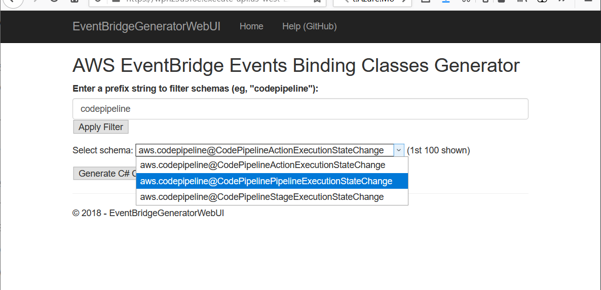

# EventBridgeBindingGeneratorForDotNet

A quick and dirty .NET Standard ~~2.0~~ 2.1 library that generates all the classes to use as bindings for deserializing EventBridge schemas. This is handy for generating the (sometimes many) classes that map to a complex JSON EventBridge schema. For example, if you're using a .NET Lambda function (or anything else) as the target of an [AWS EventBridge rule](https://aws.amazon.com/eventbridge/).
The generator library itself has two public methods: 

 * `GenerateCodeFilesAsStrings` returns a List<ClassContainer>, where ClassContainer has the class name, the class as a string, and a ChildClasses property of List<ClassContainer>. This is useful if you want to organize child classes into folders, or add hierarchical namespaces or something. Use a recursive function to retrieve them all - see example in SampleConsoleApp.
 * `GenerateCodeFiles` returns a byte array containing a zip file that has all the class files in it (not nested). This is the original one I wrote in 2020, and I kept it to avoid rewriting the sample web app :-)

In order to demo this, there is a simple .NET 8 console app that can either use the included test schema, fetch your discovered schnemas from EventBridge, or you can pass in a schema file path, and the resulting C# class files are written to a new "GeneratedClasses" folder.

**Update (from 2020)**
I've added an ASP.NET Core serverless web app, which adds a UI that lets you filter a list of the schemas in the AWS events 
registry, then generate the C# classes for the schema you select (which is returned as a zip file). You can deploy this project
 directly to your own AWS account using either the [AWS Toolkit for Visual Studio](https://aws.amazon.com/visualstudio/),
 or the AWS tools for Lambda. It will create an API Gateway API, a Lambda function, and an IAM role with read-only permissions to the Event Bridge schemas.

The web app is in the project *EventBridgeGeneratorWebUI*



## Disclaimer

The code itself is sorta ugly, and opportunities for cleanup and improvement abound. There's a fair bit of string concatenation. More importantly, **this has had only very limited testing** on some AWS events and some discovered events from my registry. Also note that there is **virtually no exception handling**. And no unit tests. So obviously, if you use this, use it as a starting point, do not just push to prod ;-)

## Known issue (from Aug 2020, I have not re-tested)

For one of the schemas I tested (in file aws.codepipeline@CodePipelineStageExecutionStateChange-v1.json), the detail property's properties.version attribute property is listed as "string" type in the json schema doc. But when I actually used the generated class in a Lambda function that consumes real events, the deserialization barfs, complaining that the actual value is a number (an int).  And in fact, in the actual event json, there are no quotes around the numeric value. So maybe this is an error in AWS's schemas, or something else.  The generated class could work around this by having more complicated getters/setters, and making the appropriate conversion, but it doesn't yet do that. But this is pretty minor.
I've reported the issue to the EventBridge team, and they're looking into it.

## Getting Schemas

This could be extended to pull the schemas directly from the AWS Schema Repository, the way VS Code does, but in the meantime, you can download AWS EventBridge schemas from your AWS account at https://console.aws.amazon.com/events/home?#/schemas?registry=aws.events  (note - the included web app, `EventBridgeGeneratorWebUI` does fetch schemas directly from EventBridge).

I've put a couple of the schemas that I downloaded into the SampleSchemas folder that you can use to test with.

## Output
_Note - below section is woefully out of date: the EventBridgeBindingGenerator library can return a zip file containing classes, or a collection of ClassContainer items that have the class as string, with child classes in a collection._

The output will be all of the generated C# class files in a folder named for the "title" property of the Schema (which is also the class name of the top-level class).  For each complex property in the schema (meaning, not a primitive type), a new class is created (in a new file). For some schemas, this will result in only two files, while for others it might be more than 10.  

As an example, the output of `BindingGenerator test` will create the following files for the schema `aws.codebuild@CodeBuildBuildPhaseChange-v1.json` (other schemas will lead to as few as two files):

 * AdditionalInformationItem.cs
 * CodeBuildBuildPhaseChange.cs
 * CodeBuildBuildPhaseChangeDetail.cs
 * CodeBuildBuildPhaseChangeDetailAdditionalInformation.cs
 * CodeBuildBuildPhaseChangeDetailAdditionalInformationArtifact.cs
 * CodeBuildBuildPhaseChangeDetailAdditionalInformationCache.cs
 * CodeBuildBuildPhaseChangeDetailAdditionalInformationEnvironment.cs
 * CodeBuildBuildPhaseChangeDetailAdditionalInformationLogs.cs
 * CodeBuildBuildPhaseChangeDetailAdditionalInformationNetworkInterface.cs
 * CodeBuildBuildPhaseChangeDetailAdditionalInformationSource.cs
 * CodeBuildBuildPhaseChangeDetailAdditionalInformationSourceAuth.cs
 * CodeBuildBuildPhaseChangeDetailAdditionalInformationVpcConfig.cs
 * EnvironmentItem.cs
 * VpcConfigItem.cs

## Using Generated Classes

I've used two sets of generated classes in actual Lambda functions so far (CodeBuildBuildPhaseChange and CodePipelineStageExecutionStateChange), and they both work (with caveat that the second one requires changing "Version" from string to int/float). You can use the class that has the same name as the folder it's written to as the Lambda event type, as in this example, which uses the code generated from schema aws.codepipeline@CodePipelineStageExecutionStateChange-v1.json.

Be sure to copy the generated folder full of generated classes into your project and adjust any namespaces if desired.

```c#
using Amazon.Lambda.Core;

// Assembly attribute to enable the Lambda function's JSON input to be converted into a .NET class.
[assembly: LambdaSerializer(typeof(Amazon.Lambda.Serialization.SystemTextJson.DefaultLambdaJsonSerializer))]

namespace PipelineStateChangeHandler
{
    public class Function
    {
        public void FunctionHandler(CodePipelineStageExecutionStateChange pipelineEvent, ILambdaContext context)
        {
            LambdaLogger.Log($"Account ID: {pipelineEvent.Account}, Pipeline: {pipelineEvent.Detail.Pipeline}");
            LambdaLogger.Log($"Stage: {pipelineEvent.Detail.Stage}, state: {pipelineEvent.Detail.State}");
            LambdaLogger.Log($"Resources array count: {pipelineEvent.Resources.Length}");
        }
    }
}
```
